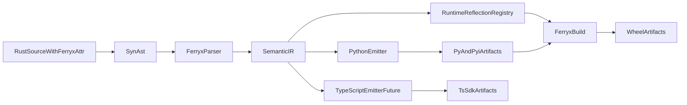

# ferryx

[](https://github.com/rithulkamesh/ferryx/actions/workflows/ci.yml)
[](https://github.com/rithulkamesh/ferryx/actions/workflows/wheels.yml)
[](https://github.com/rithulkamesh/ferryx/actions/workflows/docs.yml)
[](https://github.com/rithulkamesh/ferryx/actions/workflows/benchmarks.yml)
[](https://crates.io/crates/ferryx-ir)
[](https://pypi.org/project/ferryx/)
[](LICENSE)
[](https://www.star-history.com/#rithulkamesh/ferryx&Date)

Rust systems. Native ecosystems. Zero wrapper drift.

ferryx compiles Rust systems into native language ecosystems.
It does this by projecting Rust semantics through a stable semantic IR and deterministic rewrite pipeline into target emitters.
It includes a semantic rewrite engine that transforms Rust semantics into Python-native ergonomics before emission.

## 1) Hero

ferryx is not a transpiler and not a wrapper generator.

It is a semantic binding system:

- Rust is the source of truth.
- IR is the contract.
- Python is a generated projection with native ergonomics.
- TypeScript is a first-class target on the roadmap, not an afterthought.

## 2) Philosophy

- Keep language boundaries explicit.
- Encode semantics once in Rust + IR, not duplicated by hand.
- Generate APIs that feel handwritten in target ecosystems.
- Treat performance and compatibility as product features.

## 3) Why not just PyO3?

PyO3 and maturin are excellent foundations for extension modules. ferryx solves a different systems problem:

- PyO3 focuses on writing bindings.
- ferryx focuses on generating SDKs from semantic metadata.
- PyO3 gives interop primitives.
- ferryx provides reflection-driven projection pipeline and typed emitter infrastructure.

Use both together: ferryx can orchestrate projection and packaging while relying on PyO3 where extension integration is required.

## 4) Core Architecture

Direct AST -> emitter output is forbidden by design.



## 5) Example

Rust source:

```rust
use ferryx_macros::ferryx;

#[ferryx]
pub struct Tensor {
    pub data: Vec<f32>,
}

#[ferryx]
impl Tensor {
    pub fn add(&self, other: Tensor) -> Tensor {
        other
    }
}
```

Generate IR + Python:

```bash
cargo run -p cargo-ferryx -- build \
  --input examples/tensor/src/lib.rs \
  --out-dir examples/tensor/generated \
  --package ferryx_tensor
```

## 6) Generated Python Output

Generated `__init__.pyi` excerpt:

```python
from __future__ import annotations
from typing import Protocol

class Tensor:
    data: list[float]
    def add(self, other: Tensor) -> Tensor: ...
```

Generated runtime class methods in `__init__.py` are emitted with Pythonic signatures and runtime binding hooks.

## 7) CLI Usage

```bash
# Bootstrap a new ferryx-ready crate
cargo run -p cargo-ferryx -- new --name my_runtime --dir .

# Build projection artifacts
cargo run -p cargo-ferryx -- build --input path/to/lib.rs --out-dir dist --package mypkg

# Inspect semantic IR
cargo run -p cargo-ferryx -- inspect --input path/to/lib.rs --package mypkg

# Inspect + export IR snapshot
cargo run -p cargo-ferryx -- inspect-ir --input path/to/lib.rs --package mypkg --out-json ir.json

# Emit graph views
cargo run -p cargo-ferryx -- graph --input path/to/lib.rs --package mypkg --format mermaid
cargo run -p cargo-ferryx -- graph --input path/to/lib.rs --package mypkg --format dot --output ir.dot

# Run benchmark harness
cargo run -p cargo-ferryx -- benchmark --suite all --output evaluation/results/latest.json

# Dev regeneration loop entrypoint
cargo run -p cargo-ferryx -- dev --input path/to/lib.rs --out-dir dist --package mypkg

# API docs view from IR
cargo run -p cargo-ferryx -- docs --input path/to/lib.rs --package mypkg
```

## 8) IR Explanation

IR captures:

- Module/class/trait/impl boundaries.
- Ownership and receiver semantics.
- Async metadata.
- Result/error surfaces for exception projection.
- Doc surfaces for generated docstrings.

IR is serialized and versioned as an explicit compatibility contract.
Versioning and stability docs:

- `docs/ir_versioning.md`
- `docs/stability.md`
- `docs/rewrite_engine.md`

## 9) Roadmap

See [ROADMAP.md](ROADMAP.md) for staged milestones.

Key near-term targets:

- IR schema hardening.
- Python emitter quality and protocol coverage.
- ABI compatibility and safety guarantees.
- Deterministic benchmark gates.

## 10) Contributing

Read:

- [CONTRIBUTING.md](CONTRIBUTING.md)
- [GOVERNANCE.md](GOVERNANCE.md)
- [MAINTAINERS.md](MAINTAINERS.md)
- [rfcs/README.md](rfcs/README.md)

## 11) Benchmarks Vision

ferryx benchmark suite tracks:

- call overhead
- zero-copy throughput
- async latency
- generation speed
- import time

Benchmark infrastructure lives in [benchmarks/](benchmarks/) and [docs/performance.md](docs/performance.md).

## 12) Future Targets

ferryx IR is language-agnostic by design. Planned projections include:

- TypeScript SDK generation (high-priority target)
- WASM host bindings
- Julia and R data API projection
- OpenAPI and gRPC schema projection

See [VISION.md](VISION.md).

