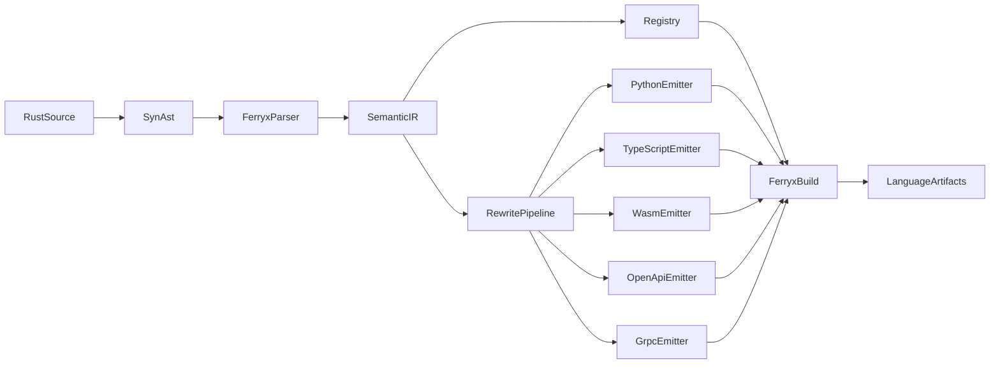

# Architecture Overview

ferryx multi-target pipeline:

1. Parse Rust AST with `syn`.
2. Convert into semantic IR.
3. Register reflection descriptors at runtime.
4. Execute rewrite pipeline with target compatibility checks.
5. Emit target-language SDKs/schemas from IR.
5. Package artifacts (wheels, metadata, docs).

Design invariant: parser and emitter remain decoupled through IR.

